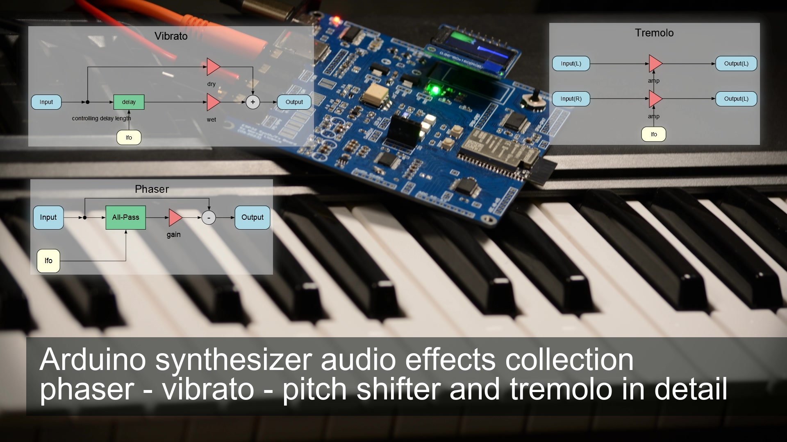

<h1 align="center">ml_synth_effects_example</h1>
<h3 align="center"Arduino synthesizer audio effects collection: phaser - vibrato - pitch shifter, tremolo, reverb and delay </h3>  

 
   
  <a href="https://youtu.be/hqK_U22Jha8">link to the video ESP32</a>

The required library can be found here: https://github.com/marcel-licence/ML_SynthTools

Supported versions of board library
---
This project is an example supporting the following platforms:
- ESP32, for more details look <a href="doc/board_info.md">here</a>

More information will be available in future